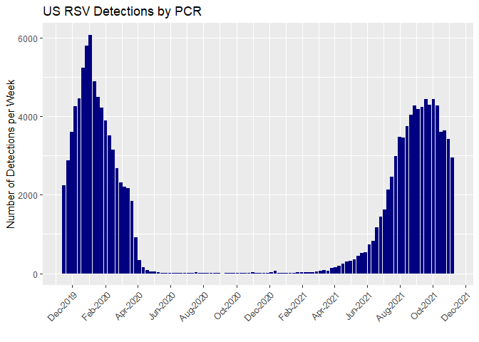
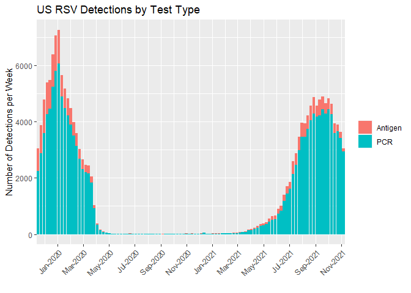
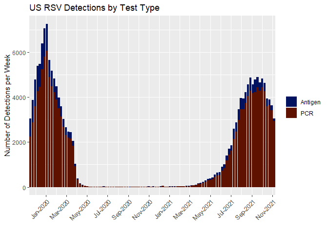
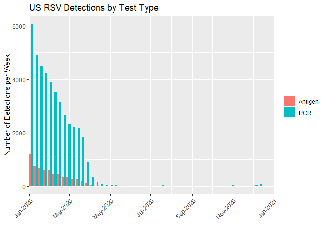
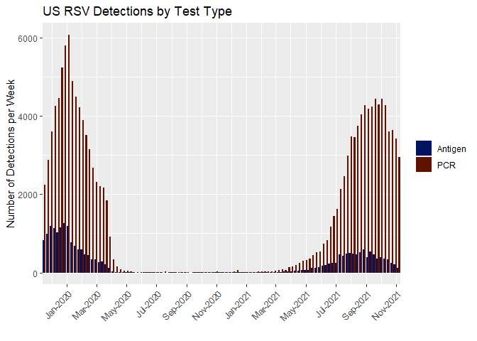

    library(here)
    library(rvest)
    library(dplyr)
    library(lubridate)
    library(tidyr)
    library(ggplot2)
    library(scico)

# Scrape RSV surveillance data from CDC

    url <- "https://www.cdc.gov/surveillance/nrevss/images/trend_images/RSV14Num_Nat.htm"

    rsvdata <- url%>%
      read_html()%>%
      html_nodes(xpath = "/html/body/table")%>%
      html_table()%>%
      .[[1]]

    head(rsvdata)

    ## # A tibble: 6 x 4
    ##      `` RepWeekDate `Antigen Detections` `PCR Detections`
    ##   <int> <chr>                      <int>            <int>
    ## 1     1 11/16/19                     823             2237
    ## 2     2 11/23/19                     985             2884
    ## 3     3 11/30/19                    1186             3600
    ## 4     4 12/07/19                    1131             4266
    ## 5     5 12/14/19                    1034             4452
    ## 6     6 12/21/19                    1152             5242

    rsvdata <- rsvdata%>%
      rename(week = "")%>%
      mutate(Antigen = as.numeric(`Antigen Detections`),
             PCR = as.numeric(`PCR Detections`),
             wk_date = as_date(RepWeekDate, 
                               format = guess_formats(RepWeekDate, "mdy")[1]))%>%
      select(week, wk_date, Antigen, PCR)

  

# Make simple bar chart of RSV PCR detections over time

    ggplot(rsvdata)+
      geom_bar(aes(x = wk_date, y = PCR), stat = "identity", fill = "navy")+
      scale_x_date(date_labels="%b-%Y", date_breaks="2 months")+
      labs(y = "Number of Detections per Week", x = "", title = "US RSV Detections by PCR")+
      theme(axis.text.x = element_text(angle = 45, vjust = 1, hjust = 1))

  

# Include data on the number of antigen tests as well

First we need to transform the data to “long form” (i.e. 2 rows per week
– one with the number of PCR detections and the other with the number of
antigen detections).  

  

## Stacked

    ggplot(rsvdata_long)+
      geom_bar(aes(x = wk_date, y = count, fill = test_type), stat = "identity", )+
      scale_x_date(date_labels="%b-%Y", date_breaks="2 months", expand=c(0,0))+
      labs(y = "Number of Detections per Week", x = "", title = "US RSV Detections by Test Type")+
      theme(axis.text.x = element_text(angle = 45, vjust = 1, hjust = 1),
            legend.title = element_blank())

  

### Change the fill colors of the plot.

  

    ggplot(rsvdata_long)+
      geom_bar(aes(x = wk_date, y = count, fill = test_type), stat = "identity", )+
      scale_x_date(date_labels="%b-%Y", date_breaks="2 months", expand=c(0,0))+
      labs(y = "Number of Detections per Week", x = "", title = "US RSV Detections by Test Type")+
      scale_fill_scico_d(palette = 'vik')+
      theme(axis.text.x = element_text(angle = 45, vjust = 1, hjust = 1),
            legend.title = element_blank())

  

## Stacked

    ggplot(rsvdata_long)+
      geom_bar(aes(x = wk_date, y = count, fill = test_type), position = "dodge", stat = "identity", )+
      scale_x_date(date_labels="%b-%Y", date_breaks="2 months", expand=c(0,0))+
      tidyquant::coord_x_date(xlim = c("2020-01-01", "2021-01-01"))+
      labs(y = "Number of Detections per Week", x = "", title = "US RSV Detections by Test Type")+
      theme(axis.text.x = element_text(angle = 45, vjust = 1, hjust = 1),
            legend.title = element_blank())

  

### Change the fill colors of the plot.

  

    ggplot(rsvdata_long)+
      geom_bar(aes(x = wk_date, y = count, fill = test_type), position = "dodge", stat = "identity", )+
      scale_x_date(date_labels="%b-%Y", date_breaks="2 months", expand=c(0,0))+
      labs(y = "Number of Detections per Week", x = "", title = "US RSV Detections by Test Type")+
      scale_fill_scico_d(palette = 'vik')+
      theme(axis.text.x = element_text(angle = 45, vjust = 1, hjust = 1),
            legend.title = element_blank())

